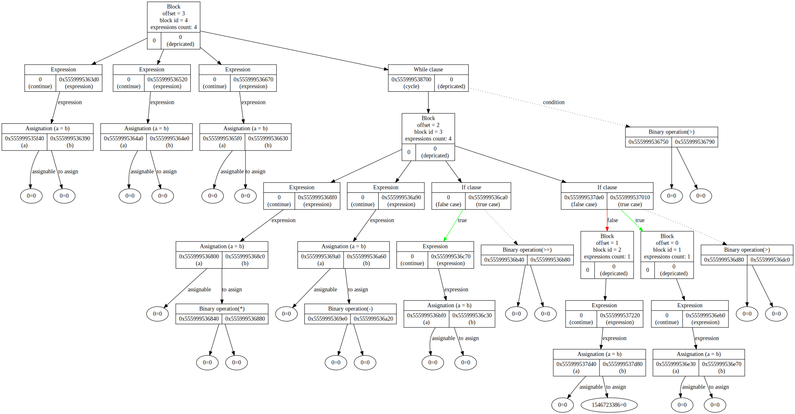

# Bison realization for ParaCL
## Warning!
This implemintation is only test, some features do not work properly, compilation is only for test suites
## Compilation for test
Now this programm can generate trees with ast-tree(nowadays there are some problems with variables)
for compile: `make all`, then run with: `./test.out`, additionally you can give source code with: `./test.out < souce_code.pcl`.
## Example
We can run code like this:
```
n = 3;
fact = 1;
flg = 0;

while (n > 0) {
  fact = fact * n;
  n = n - 1;
  if (n >= 5) flg = 1;
  if (fact > 10) {
    flg = 3;
  } else {
    flg = 7;
  }
}
```
As output we get:
